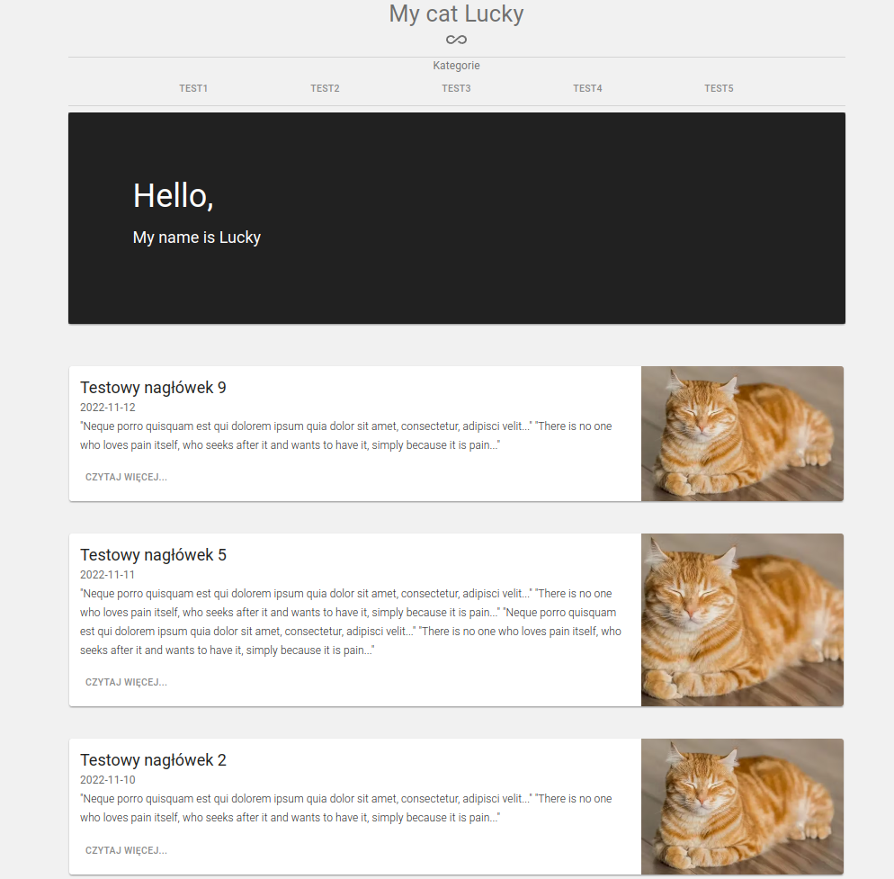

# Blog

In this project I used [prismic](https://prismic.io/) to create contents that are downloaded from [API](https://prismic.io/docs/technologies/introduction-to-the-content-query-api). You can select a category and view the post. The website uses pagination.


**Main features**:
- React
- React Route
- Material UI

&nbsp;
 
## 💡 Technologies


&nbsp;
 
## 💿 Installation

The project uses [node](https://nodejs.org/en/) and [npm](https://www.npmjs.com/). 
&nbsp;

To run it locally you should install all dependencies:

    npm i

To run webpack and create a localhost port you should type:

    npm start
    
Runs the app in the development mode.\
Open [http://localhost:3000](http://localhost:3000) to view it in your browser.

The page will reload when you make changes.\
You may also see any lint errors in the console.
&nbsp;


&nbsp;

## 🤔 Solutions provided in the project

1. Example of the pagination used in this project.
```
const Pagination = props => {
  const { children, lenght, path, limit = 1 } = props

  return (
    <Routes>
      <Route
        path={`${path}/:page` & {}}
        element={
          <PaginationRoute
            path={path}
            limit={limit}
            lenght={lenght}
            children={children}
          />
                }
      >
      </Route>
    </Routes>
  )
}
	...
```

2. Prismic configuration.
```
import * as prismic from '@prismicio/client'

export const repositoryName = 'my-cat-lucky'

export const client = prismic.createClient(repositoryName, {
  accessToken: '',

  routes: [
    {
      type: 'header',
      path: '/'
    }
  ]
})

```
&nbsp;
 
<h1 align="center">Hi , I'm Szymon </h1>
<h4 align="center">I am looking for my first professional experience.</h4>

 <h3>Connect with me:</h3>

[](https://www.linkedin.com/in/sludwikowski) 
[](https://www.facebook.com/szymonludwikowskii/)


&nbsp;

## 👏 Thanks / Special thanks / Credits

To  [Akademia Samouka](https://akademiasamouka.pl/) 
